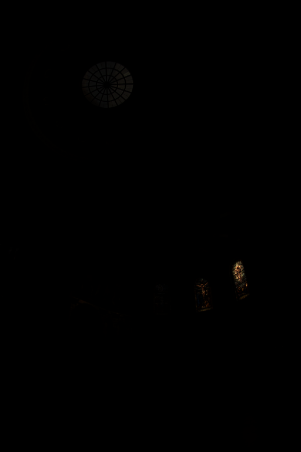
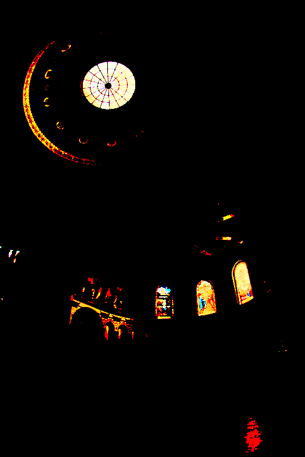
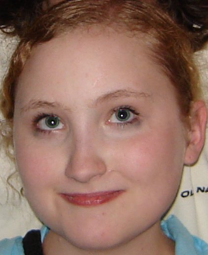

# CUDA_tuts

This contains all the work and notes from the lectures from CS344 Introduction to parallel programming.
All the notes are compiled in the in Notes.txt .

# Problem Sets #

## Problem 1: RBG to Grayscale ##
Key concepts:
- Simple example of setting up kernels and deciding blocks and grids sizes.
- Implementing the MAP operation to convert an RGB image to grayscale.

 

## Problem 2: Gaussian Blur ##
Key concepts:
- Perform a GATHER operation to apply the Gaussian mask on each pixel.

 

## Problem 3: Tone Mapping ##
Key concepts:
- Perform min/max REDUCE operation on the log-luminance channel of the image.
- Generate a HISTOGRAM using the raw luminance value and the range.
- Generate a CDF from the histogram using the Hillis/Steele SCAN.

Tone Mapping reveals features which are lost due to bad illumination. This is apparent
in the example below if you compare the left input image clicked at low illumination
and the output right image after tone mapping.
 

## Problem 4: Removing Red Eye ##
Key concepts:
- For each pixel compute a score for the likelihood of a pixel to be a red eye pixel
by comparing it to a template.
- Perform a RADIX SORT on the scores on the GPU.
- SEGMENTED SCAN, COMPACT

 
